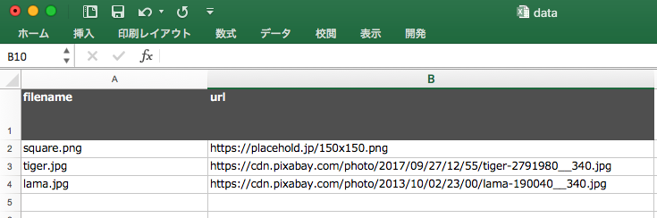
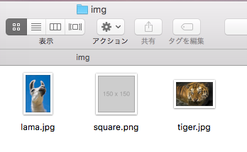

## 概要
エクセルからURLとファイル名を取得し、画像を一括ダウンロード＆リネームします。





## 環境
- mac OSX
- Node.js 6.5以上

## 使い方
1. data.xlsxにURL(http~)とファイル名(含拡張子)を記載、上書き保存
2. ルートディレクトリにて
```bash
$ gulp
```
3. img配下のファイルが一旦削除された後、指定の画像が保存されます。

## インストール
インストールしたい場所で
```bash
$ git clone https://github.com/IYA-UFO/img_from_excel.git
```

```bash
$ cd img_from_excel
```
```bash
$ npm install
```

npm installは1分以上かかる場合があります


## Author
IYA-UFO

## License
[MIT](http://b4b4r07.mit-license.org)
